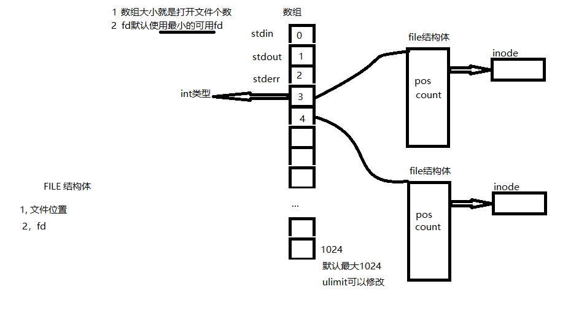

标准IO：

fopen, fclose
fprintf,sprintf,printf
fseek,ftell
fseeko,ftello
fread,fwrite
fflush

系统调用IO/文件IO

文件描述符的概念
文件io操作函数：open,close,read,write,lseek
- 将文件io与标准io的区别
- io的效率问题
- 文件共享
- 原子操作
- 程序中的重定向 dup dup2
- 同步： sync, fsync, fdatasync
- fcntl()  ioctl()
- /dev/fd/目录

:

