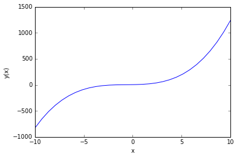
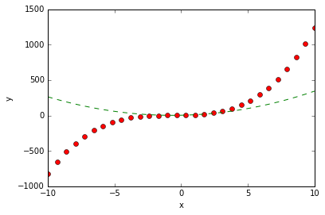
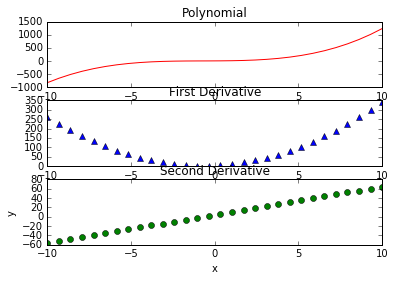
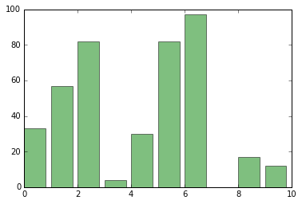

Matplotlib是一个非常有用的Python绘图库。它和NumPy结合得很好，但 本身是一个单独的开源项目。

# 1.简单绘图
matplotlib.pyplot包中包含了简单绘图功能。需要记住的是，随后调用的函数都会改变 当前的绘图。最终，我们会将绘图存入文件或使用show函数显示出来。不过如果我们用的是运行在Qt或Wx后端的IPython，图形将会交互式地更新，而不需要等待show函数的结果。这类似于屏幕上输出文本的方式，可以源源不断地打印出来。

## 1.1 绘制多项式
使用`np.poly1d`可以生成多项式，如

``` python
func = np.poly1d(np.array([1, 2, 3, 4]).astype(float))
```
表示函数：
`$y=1*x^3+2*x^2+3*x+4$`

画图：
```python
import numpy as np
import matplotlib.pyplot as plt
func = np.poly1d(np.array([1, 2, 3, 4]).astype(float))  # 多项式
x = np.linspace(-10, 10, 30)
y = func(x)
plt.plot(x, y)
plt.xlabel('x')
plt.ylabel('y(x)')
plt.show()
```



> plot函数可以接受任意个数的参数。在前面一节中，我们给了两个参数。我们还可以使用 可选的格式字符串参数指定线条的颜色和风格，默认为b-即蓝色实线。你可以指定为其他颜色和 风格，如红色虚线。

## 1.2 绘制多项式及其导数

使用`deriv`来求导数。
```python
func = np.poly1d(np.array([1, 2, 3, 4]).astype(float))
func1 = func.deriv(m=1)
```
也可使用`polyder`来求导。
```python
func = np.poly1d(np.array([1, 2, 3, 4]).astype(float))
func1 = np.polyder(func)
```
其他一些方法：
```
多项式拟合：poly= np.polyfit(x,a,n),拟合点集a得到n级多项式，其中x为横轴长度，返回多项式的系数
多项式求导函数：np.polyder(poly),返回导函数的系数
得到多项式的n阶导函数：多项式.deriv(m = n)
多项式求根：np.roots(poly)
多项式在某点上的值：np.polyval(poly,x[n]),返回poly多项式在横轴点上x[n]上的值
两个多项式做差运算： np.polysub(a,b)
```
画图：
```python
import numpy as np
import matplotlib.pyplot as plt
func = np.poly1d(np.array([1, 2, 3, 4]).astype(float))
func1 = np.polyder(func)
x = np.linspace(-10, 10, 30)
y = func(x)
y1 = func1(x)
plt.plot(x, y, 'ro', x, y1, 'g--')  # ro 表示：red，圈； g--表示：green，虚线
plt.xlabel('x')
plt.ylabel('y')
plt.show()
```



# 2.子图
绘图时可能会遇到图中有太多曲线的情况，而你希望分组绘制它们。这可以使用subplot函数完成。

# 2.1 绘制多项式函数及其导函数
我们来绘制一个多项式函数及其一阶和二阶导函数。为了使绘图更加清晰，我们将绘制3张子图。
```python
func = np.poly1d(np.array([1, 2, 3, 4]).astype(float))
x = np.linspace(-10, 10, 30)
y = func(x)
func1 = func.deriv(m=1)  # 求一阶导数
y1 = func1(x)
func2 = func.deriv(m=2)  # 求二阶导数
y2 = func2(x)

plt.subplot(311)  # 311表示3行，1列，第1个图
plt.plot(x, y, 'r-' )  #红色，实线
plt.title("Polynomial")  # 图标题

plt.subplot(312)  #第2个图
plt.plot(x, y1, 'b^') #蓝色，三角形
plt.title("First Derivative")

plt.subplot(313)
plt.plot(x, y2, 'go') # 绿色，散点图
plt.title("Second Derivative")

plt.xlabel('x')  # 横坐标
plt.ylabel('y')  # 纵坐标
plt.show()  # 显示图
```


# 3.直方图

直方图（histogram）可以将数据的分布可视化。Matplotlib中有便捷的hist函数可以绘制直方图。该函数的参数中有这样两项——包含数据的数组以及柱形的数量。


使用plt.bar画直方图。
```python
import numpy as np
import matplotlib.pyplot as plt
x = np.arange(10)
y = np.random.randint(0,100,10) # 在0到100，取10个随机数
plt.bar(x,y,color='g',alpha=0.5)  #alpha透明度
plt.show()
```



# 4.定制绘图

# 5.三维绘图

# 6.等高线图

# 7.动画

# 8.对数坐标图
