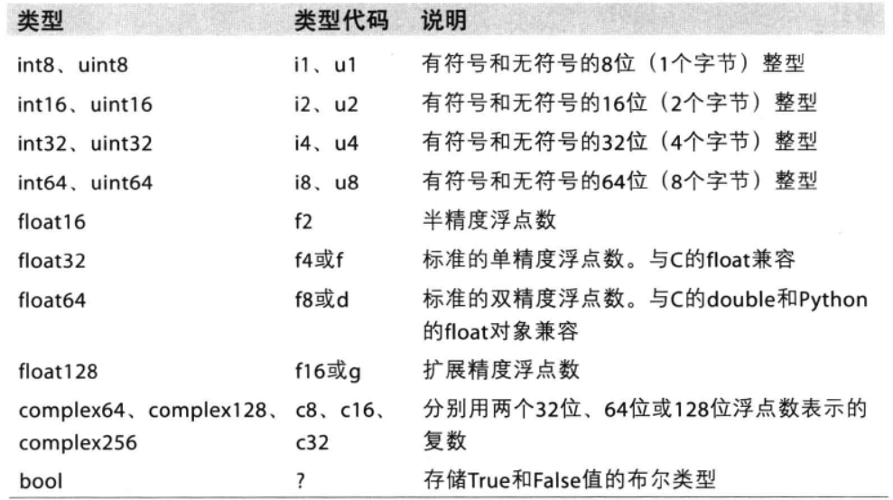
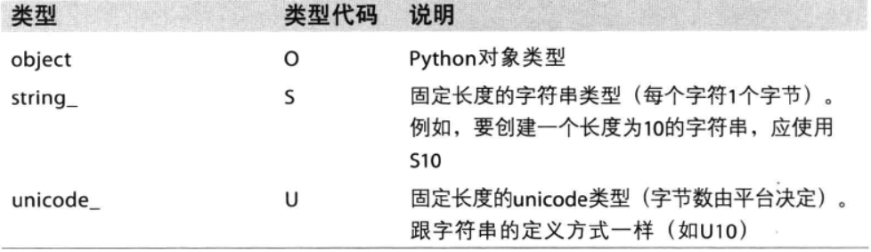
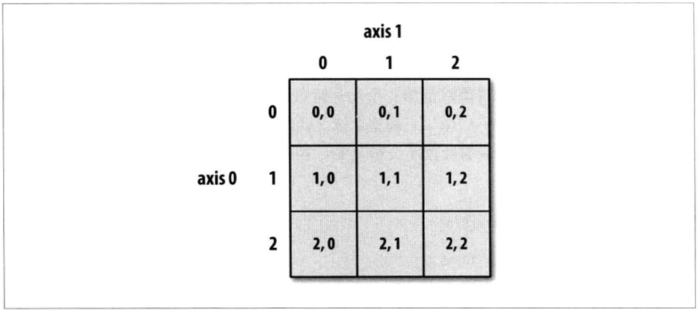
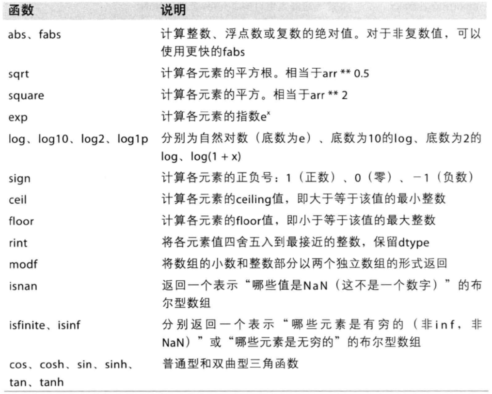
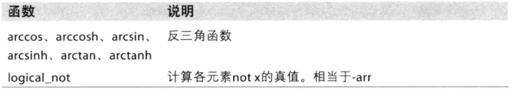
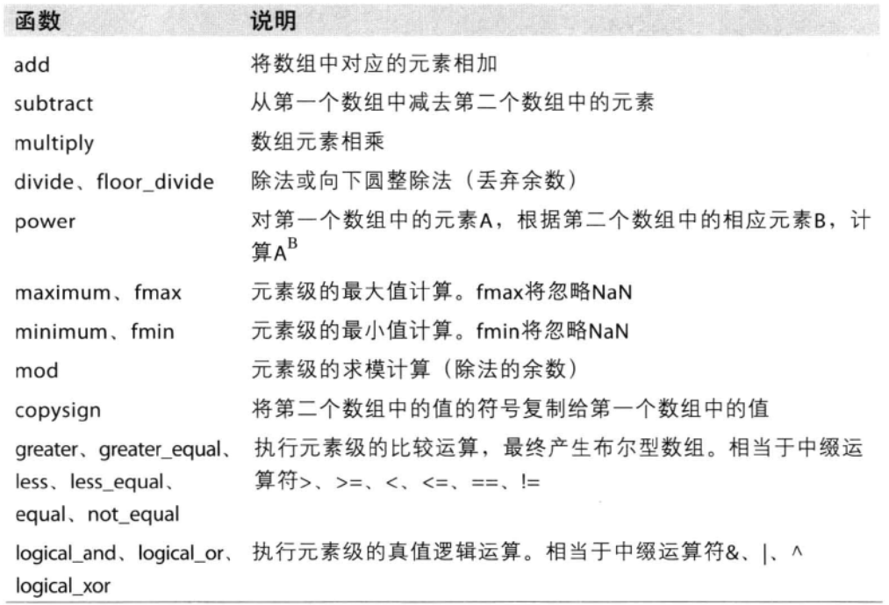

Numpy（Numerical Python的简称）高性能科学计算和数据分析的基础包。其部分功能如下：
- ndarray，具有矢量算术运算和复杂广播能力的快速且节省空间的多维数组。
- 数组运算，不用编写循环
- 可以读写磁盘数据，操作内存映射
- 线性代数
- 集成c，c++等语言

python能够包装c、c++以numpy数组形式的数据。pandas提供了结构化或表格化数据的处理高级接口，
还提供了numpy不具备的时间序列处理等；

# 1.ndarray：多维数组对象
多维数组，要求所有元素的类型一致，通常说的“数组”、“Numpy数组”、“ndarray”都是指“ndarray”对象。
## 1.1 创建ndarray
函数 | 说明
- | -
array | 输入数据转换为ndarray对象，可以是python元组、列表或其他序列类型。可以自动识别dtype，或者手动指定类型
asarray | 将输入数据转换为ndarray对象
arange | 类似range，返回ndarray的一维序列数组
ones，ones_like | 创建全1数组，默认float类型。ones_like创建一个类型输入数组的全1数组
zeros，zeros_like | 与ones相同，创建全0数组
empty，empty_like | 全空数组，只分配内存空间，不填充任何值
eye、identity | 创建一个n*n的单位矩阵（阵列）


```python
In [1]: import numpy as np
In [2]: np.arange(10)
Out[2]: array([0, 1, 2, 3, 4, 5, 6, 7, 8, 9])

In [3]: np.array([1,2,3,5,6,7])
Out[3]: array([1, 2, 3, 5, 6, 7])

In [4]: np.ones((3,1))
Out[4]:
array([[ 1.],
       [ 1.],
       [ 1.]])

In [5]: np.zeros((2,5))
Out[5]:
array([[ 0.,  0.,  0.,  0.,  0.],
       [ 0.,  0.,  0.,  0.,  0.]])

In [6]: np.eye(3)
Out[6]:
array([[ 1.,  0.,  0.],
       [ 0.,  1.,  0.],
       [ 0.,  0.,  1.]])

In [7]: np.empty((2,4))
Out[7]:
array([[  0.00000000e+000,   0.00000000e+000,   2.12267575e-314,
          2.19986168e-314],
       [  2.15551710e-314,   2.19976181e-314,   2.31584192e+077,
          5.56268597e-309]])
```

## 1.2 ndarray数据类型
ndarry数组相关的数据类型
```python
In [1]: import numpy as np

In [5]: a = np.array([1,2,4],dtype="int32")

In [6]: b = np.array([1,3,5],dtype=np.float32)

In [9]: a.dtype
Out[9]: dtype('int32')

In [10]: b.dtype
Out[10]: dtype('float32')
```
当需要控制数据在内存和磁盘中的存储方式时，尤其是大数据集，就需要了解如何控制存储类型。
dtype的表示形式有几种：
- 类型列中的值，使用字符串方式：如“int8”；
- 类型列中的值，使用如np.int8表示；
- 类型代码列中的值，使用字符串表示，如“f2”；

下表是所有支持的类型和说明：







也可以使用astype修改dtype。
```python
In [11]: a
Out[11]: array([1, 2, 4])

In [12]: c = a.astype("float64")

In [13]: c
Out[13]: array([ 1.,  2.,  4.])

In [14]: c.dtype
Out[14]: dtype('float64')
```
在格式转换过程中：
- 浮点数转换成整数，浮点数小数部分会被去掉；
- 如果字符串格式的数字，可以转换为数值形式；
- 复数转换

## 1.3 数组和标量之间的运算
数组的优势在于“矢量化”的运算，运算会应用到数组中的元素。
不需要编写循环进行运算，而且效率也比使用循环高。
```python
In [17]: a
Out[17]:
array([[0, 1, 2, 3, 4],
       [5, 6, 7, 8, 9]])

In [18]: b
Out[18]:
array([[ 0,  2,  4,  6,  8],
       [10, 12, 14, 16, 18]])

In [19]: a + b  # 计算两个数组的和
Out[19]:
array([[ 0,  3,  6,  9, 12],
       [15, 18, 21, 24, 27]])

In [21]: a * 10  # 每个元素*10
Out[21]:
array([[ 0, 10, 20, 30, 40],
       [50, 60, 70, 80, 90]])
```
## 1.4 基本索引和切片
### 1.4.1 切片
Numpy切片功能与python的列用法是相同的，但是在是否复制切片数据是有区别的。
- python列表切片的时候复制数据
- **Numpy数组切片直接操作原数组**

python 列表切片操作
```python
#
In [24]: list1 = list(range(10))

In [25]: list1
Out[25]: [0, 1, 2, 3, 4, 5, 6, 7, 8, 9]

In [26]: id(list1)
Out[26]: 104821896

In [27]: list1_slice = list1[2:5]

In [28]: id(list1_slice)
Out[28]: 104992840

In [29]: list1_slice
Out[29]: [2, 3, 4]

In [30]: list1_slice[0] = 100

In [31]: list1_slice
Out[31]: [100, 3, 4]

In [32]: list1 # 注意2号位置没有变化
Out[32]: [0, 1, 2, 3, 4, 5, 6, 7, 8, 9]
```

Numpy 数组切片操作
```python
In [33]: arr = np.arange(10)

In [34]: arr
Out[34]: array([0, 1, 2, 3, 4, 5, 6, 7, 8, 9])

In [35]: id(arr)
Out[35]: 105028784

In [36]: arr_slice = arr[2:5]

In [37]: arr_slice
Out[37]: array([2, 3, 4])

In [38]: arr_slice[0] = 100

In [39]: arr_slice
Out[39]: array([100,   3,   4])

In [40]: id(arr_slice)
Out[40]: 105029024

In [41]: arr  #2号位置被赋值了。
Out[41]: array([  0,   1, 100,   3,   4,   5,   6,   7,   8,   9])
```
这样做的原因是Numpy为了能够更好的处理大数据集。如果每次复制将会大大的消耗内存。

### 1.4.2 索引
二维数组索引如下





可以使用两种方式：
- 使用两个索引
- 使用两个值表示的列表作为索引

```python
In [43]: a
Out[43]:
array([[0, 1, 2],
       [3, 4, 5],
       [6, 7, 8]])

In [44]: a[0]  #先行后列
Out[44]: array([0, 1, 2])

In [45]: a[0][1]
Out[45]: 1

In [46]: a[0,1]
Out[46]: 1
```
如果是多维数组的话,可以使用标量值或者数组来赋值。
```python
In [50]: b
Out[50]:
array([[[ 1,  2,  3],
        [ 4,  5,  6]],

       [[ 7,  8,  9],
        [10, 11, 12]]])

In [51]: b[0]
Out[51]:
array([[1, 2, 3],
       [4, 5, 6]])

In [52]: old_values = b[0]

In [53]: b[0] = 100

In [54]: b
Out[54]:
array([[[100, 100, 100],
        [100, 100, 100]],

       [[  7,   8,   9],
        [ 10,  11,  12]]])

In [55]: b[0] = old_values

In [56]: b
Out[56]:
array([[[100, 100, 100],
        [100, 100, 100]],

       [[  7,   8,   9],
        [ 10,  11,  12]]])

```
### 1.4.3 布尔型索引
直接看例子,有一组7*4的数据data，每行分别属于names数组中的人所有。
```python
names = np.array(["Bob","Joe","Will","Bob","Will","Joe","Joe"])
data = np.random.randn(7,4)

names
Out[4]:
array(['Bob', 'Joe', 'Will', 'Bob', 'Will', 'Joe', 'Joe'],
      dtype='<U4')

data
Out[5]:
array([[-0.3153179 ,  1.01375816, -0.34210821, -0.74311504],
       [-0.4196392 , -0.80468813,  0.65295259,  0.10492046],
       [-0.40579151,  0.83195776,  0.71036512, -1.66161549],
       [ 0.043161  , -0.68926623, -0.20530643,  0.82019059],
       [-0.0088418 , -1.16661084,  0.36412278, -0.9806821 ],
       [-0.02528605, -0.42485406,  0.26363666, -0.3005965 ],
       [-1.62686502,  0.64529883, -0.23470384,  0.77666136]])

```
通过比较运算可以产生一个布尔型的数组,并把它作为索引
```python
names == "Bob"
Out[6]: array([ True, False, False,  True, False, False, False], dtype=bool)

data[names=="Bob"]  #作为索引
Out[7]:
array([[-0.3153179 ,  1.01375816, -0.34210821, -0.74311504],
       [ 0.043161  , -0.68926623, -0.20530643,  0.82019059]])

data[names=="Bob",:2]  #还能跟整数混用
Out[8]:
array([[-0.3153179 ,  1.01375816],
       [ 0.043161  , -0.68926623]])

```
还能这么用：
```python
data[names!="Bob"]
Out[9]:
array([[-0.4196392 , -0.80468813,  0.65295259,  0.10492046],
       [-0.40579151,  0.83195776,  0.71036512, -1.66161549],
       [-0.0088418 , -1.16661084,  0.36412278, -0.9806821 ],
       [-0.02528605, -0.42485406,  0.26363666, -0.3005965 ],
       [-1.62686502,  0.64529883, -0.23470384,  0.77666136]])

data[-(names=="Bob")]  # - 号已经不太使用，请使用~代替
Out[10]:
array([[-0.4196392 , -0.80468813,  0.65295259,  0.10492046],
       [-0.40579151,  0.83195776,  0.71036512, -1.66161549],
       [-0.0088418 , -1.16661084,  0.36412278, -0.9806821 ],
       [-0.02528605, -0.42485406,  0.26363666, -0.3005965 ],
       [-1.62686502,  0.64529883, -0.23470384,  0.77666136]])

data[~(names=="Bob")]
Out[11]:
array([[-0.4196392 , -0.80468813,  0.65295259,  0.10492046],
       [-0.40579151,  0.83195776,  0.71036512, -1.66161549],
       [-0.0088418 , -1.16661084,  0.36412278, -0.9806821 ],
       [-0.02528605, -0.42485406,  0.26363666, -0.3005965 ],
       [-1.62686502,  0.64529883, -0.23470384,  0.77666136]])

```
还有：
- `&`表示和，`|`表示或
- python中的and和or在ndarray中不能使用

```python
mask = (names == "Bob")|(names =="Will" )

mask
Out[13]: array([ True, False,  True,  True,  True, False, False], dtype=bool)

data[mask]
Out[14]:
array([[-0.3153179 ,  1.01375816, -0.34210821, -0.74311504],
       [-0.40579151,  0.83195776,  0.71036512, -1.66161549],
       [ 0.043161  , -0.68926623, -0.20530643,  0.82019059],
       [-0.0088418 , -1.16661084,  0.36412278, -0.9806821 ]])
```
同样，还能赋值
```python
data[data < 0] =0

data
Out[16]:
array([[ 0.        ,  1.01375816,  0.        ,  0.        ],
       [ 0.        ,  0.        ,  0.65295259,  0.10492046],
       [ 0.        ,  0.83195776,  0.71036512,  0.        ],
       [ 0.043161  ,  0.        ,  0.        ,  0.82019059],
       [ 0.        ,  0.        ,  0.36412278,  0.        ],
       [ 0.        ,  0.        ,  0.26363666,  0.        ],
       [ 0.        ,  0.64529883,  0.        ,  0.77666136]])

data[names=="Joe"] = 2

data
Out[20]:
array([[ 0.        ,  1.01375816,  0.        ,  0.        ],
       [ 2.        ,  2.        ,  2.        ,  2.        ],
       [ 0.        ,  0.83195776,  0.71036512,  0.        ],
       [ 0.043161  ,  0.        ,  0.        ,  0.82019059],
       [ 0.        ,  0.        ,  0.36412278,  0.        ],
       [ 2.        ,  2.        ,  2.        ,  2.        ],
       [ 2.        ,  2.        ,  2.        ,  2.        ]])
```

### 1.4.4 花式索引
为了特定的选取行的子集，可以传入一个列表或者ndarray。
```python
arr
Out[26]:
array([[ 0.,  0.,  0.,  0.],
       [ 1.,  1.,  1.,  1.],
       [ 2.,  2.,  2.,  2.],
       [ 3.,  3.,  3.,  3.],
       [ 4.,  4.,  4.,  4.],
       [ 5.,  5.,  5.,  5.],
       [ 6.,  6.,  6.,  6.],
       [ 7.,  7.,  7.,  7.]])

arr[[4,2,1,5]]
Out[27]:
array([[ 4.,  4.,  4.,  4.],
       [ 2.,  2.,  2.,  2.],
       [ 1.,  1.,  1.,  1.],
       [ 5.,  5.,  5.,  5.]])

arr_slice = [4,3,2,0]

arr[arr_slice]
Out[29]:
array([[ 4.,  4.,  4.,  4.],
       [ 3.,  3.,  3.,  3.],
       [ 2.,  2.,  2.,  2.],
       [ 0.,  0.,  0.,  0.]])
```
也可以同时传入两个参数：
```python
arr = np.arange(32).reshape(8,4)

arr
Out[31]:
array([[ 0,  1,  2,  3],
       [ 4,  5,  6,  7],
       [ 8,  9, 10, 11],
       [12, 13, 14, 15],
       [16, 17, 18, 19],
       [20, 21, 22, 23],
       [24, 25, 26, 27],
       [28, 29, 30, 31]])

arr[[1,5,7,2],[0,3,1,2]]
Out[32]: array([ 4, 23, 29, 10])
# 两个列表的值分别对应一个索引值，形成4对索引。
```
花式索引与切片不一样，总是复制到新的数组中。

### 1.4.5 数组转置和轴对换
```python
arr = np.arange(15).reshape(3,5)

arr
Out[34]:
array([[ 0,  1,  2,  3,  4],
       [ 5,  6,  7,  8,  9],
       [10, 11, 12, 13, 14]])

arr.T
Out[35]:
array([[ 0,  5, 10],
       [ 1,  6, 11],
       [ 2,  7, 12],
       [ 3,  8, 13],
       [ 4,  9, 14]])

# 来计算两个数组的内积
arr = np.random.randn(3,6)

np.dot(arr.T,arr)
Out[37]:
array([[ 3.72937613, -0.86744575, -1.62911498, -3.47666555,  0.32576022,
         0.23910857],
       [-0.86744575,  1.0711547 ,  1.02242329, -1.08977196, -1.10673674,
         0.33153465],
       [-1.62911498,  1.02242329,  1.84009989, -0.32508586, -1.30894879,
        -0.33134049],
       [-3.47666555, -1.08977196, -0.32508586,  7.68163281,  2.21901489,
        -0.72295841],
       [ 0.32576022, -1.10673674, -1.30894879,  2.21901489,  1.50075102,
        -0.12049286],
       [ 0.23910857,  0.33153465, -0.33134049, -0.72295841, -0.12049286,
         0.5919756 ]])

```
轴变换还没弄明白，待续。。。。

# 2.通用函数
**快速的元素级数组函数**

通用函数ufunc是一种对ndarray中的数据执行元素级运算的函数，可以理解为“**简单函数的矢量化包装**”。

现有的通用函数，如sqrt,exp等
```python
a = np.arange(10)

np.sqrt(a)  #求所有元素的平方根
Out[53]:
array([ 0.        ,  1.        ,  1.41421356,  1.73205081,  2.        ,
        2.23606798,  2.44948974,  2.64575131,  2.82842712,  3.        ])

np.exp(a)  #求所有元素以e为底的幂
Out[54]:
array([  1.00000000e+00,   2.71828183e+00,   7.38905610e+00,
         2.00855369e+01,   5.45981500e+01,   1.48413159e+02,
         4.03428793e+02,   1.09663316e+03,   2.98095799e+03,
         8.10308393e+03])
```

## 2.1 一元通用函数





实例：
```python
a  = np.random.randn(4,4)

a
Out[65]:
array([[-1.35563407,  0.80045511, -0.750681  , -0.15750773],
       [ 0.91350028, -0.73936677, -0.10522787,  1.95409707],
       [-0.01240254, -3.28275315,  0.75904837, -0.78694871],
       [ 2.13713841, -1.19244608, -0.11900042, -0.60834012]])

np.abs(a)
Out[68]:
array([[ 1.35563407,  0.80045511,  0.750681  ,  0.15750773],
       [ 0.91350028,  0.73936677,  0.10522787,  1.95409707],
       [ 0.01240254,  3.28275315,  0.75904837,  0.78694871],
       [ 2.13713841,  1.19244608,  0.11900042,  0.60834012]])

np.sqrt(a)
Out[69]:
array([[        nan,  0.89468157,         nan,         nan],
       [ 0.95577208,         nan,         nan,  1.39789022],
       [        nan,         nan,  0.87123382,         nan],
       [ 1.46189549,         nan,         nan,         nan]])

np.square(a)
Out[70]:
array([[  1.83774372e+00,   6.40728378e-01,   5.63521970e-01,
          2.48086851e-02],
       [  8.34482755e-01,   5.46663223e-01,   1.10729041e-02,
          3.81849537e+00],
       [  1.53822884e-04,   1.07764683e+01,   5.76154422e-01,
          6.19288270e-01],
       [  4.56736059e+00,   1.42192765e+00,   1.41610995e-02,
          3.70077706e-01]])

np.exp(a)
Out[71]:
array([[ 0.25778379,  2.22655402,  0.47204498,  0.85427021],
       [ 2.49303359,  0.47741613,  0.90011939,  7.0575437 ],
       [ 0.98767406,  0.0375248 ,  2.13624233,  0.45523172],
       [ 8.47515051,  0.30347802,  0.88780743,  0.54425351]])

np.log10(a)
Out[72]:
array([[        nan, -0.09666302,         nan,         nan],
       [-0.03929132,         nan,         nan,  0.29094613],
       [        nan,         nan, -0.11973055,         nan],
       [ 0.32983265,         nan,         nan,         nan]])

np.sign(a)
Out[73]:
array([[-1.,  1., -1., -1.],
       [ 1., -1., -1.,  1.],
       [-1., -1.,  1., -1.],
       [ 1., -1., -1., -1.]])

np.ceil(a)
Out[74]:
array([[-1.,  1., -0., -0.],
       [ 1., -0., -0.,  2.],
       [-0., -3.,  1., -0.],
       [ 3., -1., -0., -0.]])

np.floor(a)
Out[75]:
array([[-2.,  0., -1., -1.],
       [ 0., -1., -1.,  1.],
       [-1., -4.,  0., -1.],
       [ 2., -2., -1., -1.]])

np.rint(a)
Out[76]:
array([[-1.,  1., -1., -0.],
       [ 1., -1., -0.,  2.],
       [-0., -3.,  1., -1.],
       [ 2., -1., -0., -1.]])

np.isnan(a)
Out[77]:
array([[False, False, False, False],
       [False, False, False, False],
       [False, False, False, False],
       [False, False, False, False]], dtype=bool)

np.isfinite(a)
Out[78]:
array([[ True,  True,  True,  True],
       [ True,  True,  True,  True],
       [ True,  True,  True,  True],
       [ True,  True,  True,  True]], dtype=bool)

np.cos(a)
Out[79]:
array([[ 0.21350595,  0.69638016,  0.7312245 ,  0.98762128],
       [ 0.61097851,  0.73889539,  0.99446865, -0.37398373],
       [ 0.99992309, -0.99005339,  0.72549128,  0.70600953],
       [-0.53654884,  0.3693879 ,  0.9929278 ,  0.82059778]])

np.arccos(a)
Out[80]:
array([[        nan,  0.64274221,  2.41988859,  1.7289627 ],
       [ 0.41899009,  2.40292572,  1.67621936,         nan],
       [ 1.58319918,         nan,  0.70894619,  2.47664439],
       [        nan,         nan,  1.69007941,  2.22476386]])

np.logical_not(a)
Out[81]:
array([[False, False, False, False],
       [False, False, False, False],
       [False, False, False, False],
       [False, False, False, False]], dtype=bool)
```

## 2.2 二元通用函数



```python
a = np.random.randint(0,100,(2,5))

a
Out[85]:
array([[44, 64, 35, 50, 79],
       [68, 91, 62, 95,  8]])

b = np.random.randint(0,100,(2,5))

b
Out[87]:
array([[73, 17, 85, 19, 68],
       [77, 62, 45, 49, 15]])

np.add(a,b)
Out[88]:
array([[117,  81, 120,  69, 147],
       [145, 153, 107, 144,  23]])

np.subtract(a,b)
Out[89]:
array([[-29,  47, -50,  31,  11],
       [ -9,  29,  17,  46,  -7]])

np.multiply(a,b)
Out[90]:
array([[3212, 1088, 2975,  950, 5372],
       [5236, 5642, 2790, 4655,  120]])

np.divide(a,b)
Out[91]:
array([[ 0.60273973,  3.76470588,  0.41176471,  2.63157895,  1.16176471],
       [ 0.88311688,  1.46774194,  1.37777778,  1.93877551,  0.53333333]])

np.floor_divide(a,b)
Out[92]:
array([[0, 3, 0, 2, 1],
       [0, 1, 1, 1, 0]], dtype=int32)

np.power(a,b) # 全超了最大值了
Out[93]:
array([[-2147483648, -2147483648, -2147483648, -2147483648, -2147483648],
       [-2147483648, -2147483648, -2147483648, -2147483648, -2147483648]], dtype=int32)

np.maximum(a,b)  #与max的区别
Out[94]:
array([[73, 64, 85, 50, 79],
       [77, 91, 62, 95, 15]])

np.minimum(a,b)
Out[95]:
array([[44, 17, 35, 19, 68],
       [68, 62, 45, 49,  8]])

np.mod(a,b)
Out[97]:
array([[44, 13, 35, 12, 11],
       [68, 29, 17, 46,  8]], dtype=int32)

np.greater(a,b)
Out[98]:
array([[False,  True, False,  True,  True],
       [False,  True,  True,  True, False]], dtype=bool)

a >ｂ
Out[99]:
array([[False,  True, False,  True,  True],
       [False,  True,  True,  True, False]], dtype=bool)

np.logical_and(a,b)
Out[100]:
array([[ True,  True,  True,  True,  True],
       [ True,  True,  True,  True,  True]], dtype=bool)
```
## 2.3 自定义通用函数

待续。。。

# 3.数组处理数据

# 4.文件处理

# 5.线性代数

# 6.随机数

# 7.范例：随机漫步
