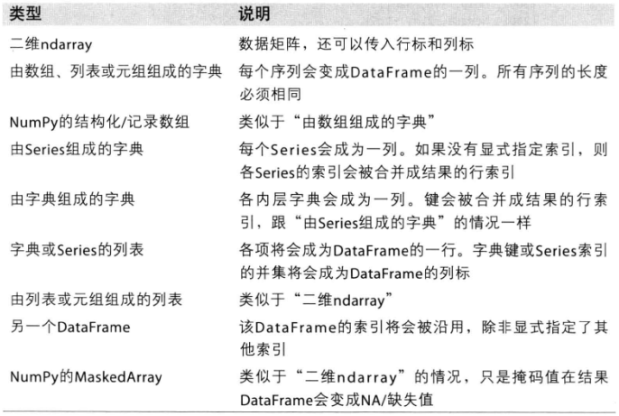
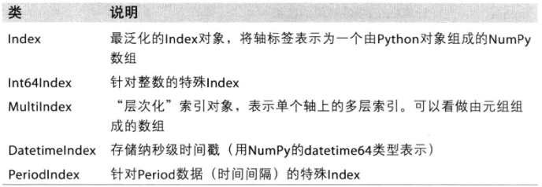
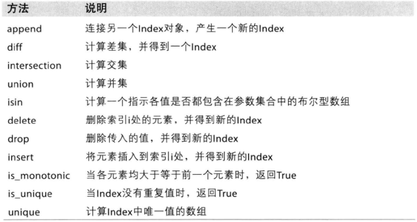
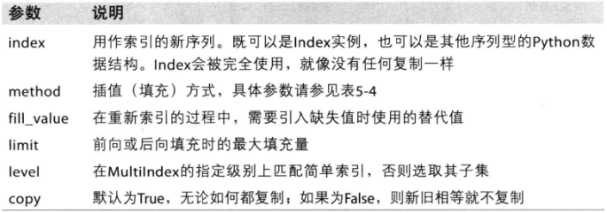
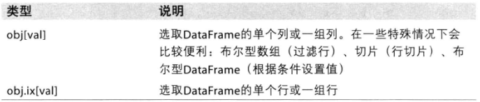
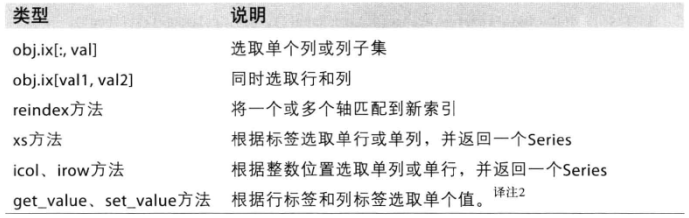

pandas是基于numpy创建，提供更高级的数据结构和操作工具，是一个不可获取的工具。

为了更好的阐述，约定如下：
```python
import pandas as pd
from pandas import Series,DataFrame
```
# 1 pandas数据结构
两个最重要的数据结构：Series和DataFrame，基本可以解决绝大部分问题。

## 1.1 Series
类似于一维数组的对象，由一组数据和一组索引组成。Series的表现形式一般为左边索引，
右边值。
```python
In [50]: obj = Series([4,7,-5,3])

In [51]: obj
Out[51]:
0    4
1    7
2   -5
3    3
dtype: int64

In [52]: obj.values
Out[52]: array([ 4,  7, -5,  3], dtype=int64)

In [53]: obj.index
Out[53]: RangeIndex(start=0, stop=4, step=1)
```
可以自定义索引：
```python
In [54]: obj2 = Series([4,7,-5,3],index=['d','b','a','c'])

In [55]: obj2
Out[55]:
d    4
b    7
a   -5
c    3
dtype: int64

In [56]: obj2.index
Out[56]: Index(['d', 'b', 'a', 'c'], dtype='object')
```
Series类似一个有序字典，可以进行查询和赋值等。
```python
In [5]: obj2['d']
Out[5]: 4

In [6]: obj2['d'] = 100

In [7]: obj2
Out[7]:
d    100
b      7
a     -5
c      3
dtype: int64

In [8]: obj2[['d','a']]
Out[8]:
d    100
a     -5
dtype: int64
```
同样可以对Series的值进行运算。
```python
In [9]: obj2 * 2
Out[9]:
d    200
b     14
a    -10
c      6
dtype: int64

In [10]: import numpy as np

In [11]: np.exp(obj2)
Out[11]:
d    2.688117e+43
b    1.096633e+03
a    6.737947e-03
c    2.008554e+01
dtype: float64
```
和字典一样的特性
```python
In [12]: 'a' in obj2
Out[12]: True

In [13]: 6 in obj2
Out[13]: False
```
可以通过字典直接来创建Series,字典的键就是Series的索引。
```python
In [14]: sdata = {'ohio':35000, 'Text':72134,'Uthch':5000}

In [15]: obj3 = Series(sdata)

In [16]: obj3
Out[16]:
Text     72134
Uthch     5000
ohio     35000
dtype: int64

# 在sdata中找不到的键值对，将使用NaN（Not a Number）来代替。
In [17]: obj4 = Series(sdata,index=['ohio','new_index'])

In [18]: obj4
Out[18]:
ohio         35000.0
new_index        NaN
dtype: float64

```
**pandas可以使用isnull和notnull检测是否缺失数据。**
```python
In [19]: obj3.isnull()
Out[19]:
Text     False
Uthch    False
ohio     False
dtype: bool

In [20]: obj4.notnull
Out[20]:
<bound method NDFrame.notnull of ohio         35000.0
new_index        NaN
dtype: float64>

In [21]: obj4.notnull()
Out[21]:
ohio          True
new_index    False
dtype: bool
In [22]: pd.isnull(obj4)
Out[22]:
ohio         False
new_index     True
dtype: bool
```
Series在算术运算中会自动对齐索引，并进行计算。
```python
In [24]: obj3 + obj4
Out[24]:
Text             NaN  #obj3
Uthch            NaN  #obj3
new_index        NaN  #obj4
ohio         70000.0
dtype: float64

```
Series还有一个name的属性，类似数据库表名。index也有一个name的属性，类似索引名字。
```python
In [27]: obj4.name

In [28]: obj4.name = "obj444"

In [29]: obj4
Out[29]:
ohio         35000.0
new_index        NaN
Name: obj444, dtype: float64

In [30]: obj4.index.name = 'state'

In [31]: obj4
Out[31]:
state
ohio         35000.0
new_index        NaN
Name: obj444, dtype: float64
```
可以通过赋值，就地就该index：
```python
In [39]: obj1 = Series([4,7,-5,3])

In [40]: obj1.index = ['Bob',"Steve","Jeff",'Ryan']

In [41]: obj1
Out[41]:
Bob      4
Steve    7
Jeff    -5
Ryan     3
dtype: int64
```
## 1.2 DataFrame

一个表格型数据结构，包含一组有序的列。典型的创建DataFrame如下：
```python
In [42]: data = {'state':['Ohio',"Ohio",'Ohio',"Nevada",'Nevada'],}

In [43]: data = {'state':['Ohio',"Ohio",'Ohio',"Nevada",'Nevada'],
    ...:          'year':[2000,2001,2002,2001,2002],
    ...:          'pop':[1.5,1.7,3.6,2.4,2.9]}

In [44]: frame = DataFrame(data)

In [45]: frame  #自动增加索引,列顺序是随机的。
Out[45]:
   pop   state  year
0  1.5    Ohio  2000
1  1.7    Ohio  2001
2  3.6    Ohio  2002
3  2.4  Nevada  2001
4  2.9  Nevada  2002
```
可以指定列进行创建：
```python
In [46]: DataFrame(data, columns=['year','state','pop'])
Out[46]:
   year   state  pop
0  2000    Ohio  1.5
1  2001    Ohio  1.7
2  2002    Ohio  3.6
3  2001  Nevada  2.4
4  2002  Nevada  2.9
In [47]: frame2 = DataFrame(data,columns=['year','state','pop','debt'],
    ...: index=['one','two','three','four','five'])

In [48]: frame2
Out[48]:
       year   state  pop debt
one    2000    Ohio  1.5  NaN
two    2001    Ohio  1.7  NaN
three  2002    Ohio  3.6  NaN
four   2001  Nevada  2.4  NaN
five   2002  Nevada  2.9  NaN
In [49]: frame2.columns
Out[49]: Index(['year', 'state', 'pop', 'debt'], dtype='object')
# 可以通过类似字典方式获取列数据，获取一列即为一个Series.
# 注意返回的是一个name被自动设置为state，索引与DataFrame相同。
In [50]: frame2['state']
Out[50]:
one        Ohio
two        Ohio
three      Ohio
four     Nevada
five     Nevada
Name: state, dtype: object

# 也可以获取行数据，通过ix
# 获取的内容与列类似
In [52]: frame2.ix['two']
Out[52]:
year     2001
state    Ohio
pop       1.7
debt      NaN
Name: two, dtype: object

# 可以给debt列赋值
In [53]: frame2['debt'] = 16.5  #可以是标量，自动全部填充

In [54]: frame2
Out[54]:
       year   state  pop  debt
one    2000    Ohio  1.5  16.5
two    2001    Ohio  1.7  16.5
three  2002    Ohio  3.6  16.5
four   2001  Nevada  2.4  16.5
five   2002  Nevada  2.9  16.5

In [55]: frame2['debt'] = np.arange(5.)  # 赋值长度必须与debt长度一直

In [56]: frame2
Out[56]:
       year   state  pop  debt
one    2000    Ohio  1.5   0.0
two    2001    Ohio  1.7   1.0
three  2002    Ohio  3.6   2.0
four   2001  Nevada  2.4   3.0
five   2002  Nevada  2.9   4.0

## 也可以用一个Series来赋值，缺失值NaN
In [59]: frame2['debt'] = Series([-1,-2,-4],index=['one','three','five'])

In [60]: frame2
Out[60]:
       year   state  pop  debt
one    2000    Ohio  1.5  -1.0
two    2001    Ohio  1.7   NaN
three  2002    Ohio  3.6  -2.0
four   2001  Nevada  2.4   NaN
five   2002  Nevada  2.9  -4.0

# 不存在列的赋值，会创建新列
In [61]: frame2['eastern'] = frame2.state == 'Ohio'

In [62]: frame2
Out[62]:
       year   state  pop  debt eastern
one    2000    Ohio  1.5  -1.0    True
two    2001    Ohio  1.7   NaN    True
three  2002    Ohio  3.6  -2.0    True
four   2001  Nevada  2.4   NaN   False
five   2002  Nevada  2.9  -4.0   False

# del 会删除列

In [63]: del frame2['eastern']

In [64]: frame2.columns
Out[64]: Index(['year', 'state', 'pop', 'debt'], dtype='object')

```
**注意：通过索引获取的数据，均为原始数据的视图，所有修改都会反应到源DataFrame上。
需要复制使用Series的copy方法。**

可以使用嵌套字典创建DataFrame。
```python
In [68]: pop = {'Nevada':{2001:2.4,2002:2.9},
    ...: 'Ohio':{2000:1.5,2001:1.7,2002:3.6}}

In [69]: frame3 = DataFrame(pop)

In [70]: frame3
Out[70]:
      Nevada  Ohio
2000     NaN   1.5
2001     2.4   1.7
2002     2.9   3.6

# 还可以转置
In [72]: frame3.T
Out[72]:
        2000  2001  2002
Nevada   NaN   2.4   2.9
Ohio     1.5   1.7   3.6

# 排序合并索引
In [73]: DataFrame(pop,index=[2001,2002,2003])
Out[73]:
      Nevada  Ohio
2001     2.4   1.7
2002     2.9   3.6
2003     NaN   NaN

In [75]: pdata = {'Ohio':frame3['Ohio'][:-1],'Nevada':frame3['Nevada'][:2]}

In [76]: DataFrame(pdata)
Out[76]:
      Nevada  Ohio
2000     NaN   1.5
2001     2.4   1.7

```
下面是所有DataFrame能接受的数据类型：




```python
In [78]: DataFrame(np.arange(10).reshape(2,5))
Out[78]:
   0  1  2  3  4
0  0  1  2  3  4
1  5  6  7  8  9
In [80]: frame3
Out[80]:
      Nevada  Ohio
2000     NaN   1.5
2001     2.4   1.7
2002     2.9   3.6

In [81]: frame3.name = 'states';frame3.index.name = 'year'

In [82]: frame3
Out[82]:
      Nevada  Ohio
year
2000     NaN   1.5
2001     2.4   1.7
2002     2.9   3.6

In [83]: frame3.columns.name = 'state'

In [84]: frame3
Out[84]:
state  Nevada  Ohio
year
2000      NaN   1.5
2001      2.4   1.7
2002      2.9   3.6

In [86]: frame3.values
Out[86]:
array([[ nan,  1.5],
       [ 2.4,  1.7],
       [ 2.9,  3.6]])

In [87]: frame2.values
Out[87]:
array([[2000, 'Ohio', 1.5, -1.0],
       [2001, 'Ohio', 1.7, nan],
       [2002, 'Ohio', 3.6, -2.0],
       [2001, 'Nevada', 2.4, nan],
       [2002, 'Nevada', 2.9, -4.0]], dtype=object)

```

## 1.3 索引

索引对象负责管理轴标签和其他元数据，没有指定的话会自动生成。一旦生成，索引对象不能修改。
```python
In [88]: obj = Series(range(3),index=['a','b','c'])

In [89]: obj.index
Out[89]: Index(['a', 'b', 'c'], dtype='object')

In [90]: index = obj.index

In [91]: index[1:]
Out[91]: Index(['b', 'c'], dtype='object')

In [92]: index[1] = 'd'
---------------------------------------------------------------------------
TypeError                                 Traceback (most recent call last)
<ipython-input-92-676fdeb26a68> in <module>()
----> 1 index[1] = 'd'

C:\Users\yangfl\Anaconda3\lib\site-packages\pandas\indexes\base.py in __setitem_
_(self, key, value)
   1243
   1244     def __setitem__(self, key, value):
-> 1245         raise TypeError("Index does not support mutable operations")
   1246
   1247     def __getitem__(self, key):

TypeError: Index does not support mutable operations

```
因为不可修改，因此可以在多个数据结构中间传递index对象。

```python
In [94]: index = pd.Index(np.arange(3))

In [95]: obj2 = Series([-0.2,-1,2],index=index)

In [96]: obj2.index == index
Out[96]: array([ True,  True,  True], dtype=bool)
```

pandas中主要的index对象：





index对象很像数组，也是一个固定的集合。
```python

In [97]: frame3
Out[97]:
state  Nevada  Ohio
year
2000      NaN   1.5
2001      2.4   1.7
2002      2.9   3.6

In [98]: 2001 in frame3.index
Out[98]: True

In [99]: 2003 in frame3.index
Out[99]: False

```
因此，索引也有自己的方法和属性：




# 2 基本功能

只是一些基本功能，更深奥的内容用到再摸索。

## 2.1 重新索引

reindex是pandas的重要方法，举个例子：
```python
In [101]: obj = Series([4,7,-5,3.4],index=['c','a','b','d'])

In [102]: obj
Out[102]:
c    4.0
a    7.0
b   -5.0
d    3.4
dtype: float64

In [103]: obj2 = obj.reindex(['a','b','c','d','e'])

In [104]: obj2
Out[104]:
a    7.0
b   -5.0
c    4.0
d    3.4
e    NaN
dtype: float64

# 缺失值可以自定义

In [105]: obj.reindex(['a','b','c','d','e'],fill_value=0)
Out[105]:
a    7.0
b   -5.0
c    4.0
d    3.4
e    0.0  #缺失值填充
dtype: float64


```
reindex的插值method选项：


参数|说明
-|-
ffill或pad | 前向填充值
bfill或backfill | 后向填充值


```python
In [106]: obj3 = Series(['blue','purple','yellow'],index=[0,2,4])

# 前向填充
In [107]: obj3.reindex(range(6),method='ffill')
Out[107]:
0      blue
1      blue
2    purple
3    purple
4    yellow
5    yellow
dtype: object

# 后向填充
In [109]: obj3.reindex(range(6),method='bfill')
Out[109]:
0      blue
1    purple
2    purple
3    yellow
4    yellow
5       NaN
dtype: object
```
针对DataFrame，可以修改行、列或两个都进行重新索引。
```python
In [111]: frame = DataFrame(np.arange(9).reshape(3,3), index=['a','b','c'],colmns=['Ohio','Texas','California'])

In [112]: frame
Out[112]:
   Ohio  Texas  California
a     0      1           2
b     3      4           5
c     6      7           8

In [113]: frame2 = frame.reindex(['a','b','c','d'])  # 默认行索引

In [115]: frame2
Out[115]:
   Ohio  Texas  California
a   0.0    1.0         2.0
b   3.0    4.0         5.0
c   6.0    7.0         8.0
d   NaN    NaN         NaN

In [116]: states = ['Texas','Utah','California']

In [117]: frame.reindex(columns=states)  #指定列索引
Out[117]:
   Texas  Utah  California
a      1   NaN           2
b      4   NaN           5
c      7   NaN           8

# 对行、列都进行重新索引，
# 并且进行插值，但是只能在0轴进行，即按行应用。
In [118]: frame.reindex(index=['a','b','c','d'],method='ffill',columns=states)
Out[118]:
   Texas  Utah  California
a      1   NaN           2
b      4   NaN           5
c      7   NaN           8
d      7   NaN           8

# 用ix更简洁。
In [119]: frame.ix[['a','b','c','d'],states]
Out[119]:
   Texas  Utah  California
a    1.0   NaN         2.0
b    4.0   NaN         5.0
c    7.0   NaN         8.0
d    NaN   NaN         NaN
```

reindex函数的参数




## 2.2 丢弃指定轴上的项

丢弃项，只要一个索引或列表即可。drop方法会返回一个删除了指定值的新对象。
```python
In [120]: obj = Series(np.arange(5.),index=['a','b','c','d','e'])

In [121]: new_obj = obj.drop('c')

In [122]: new_obj
Out[122]:
a    0.0
b    1.0
d    3.0
e    4.0
dtype: float64

In [124]: obj.drop(['d','c'])
Out[124]:
a    0.0
b    1.0
e    4.0
dtype: float64

```
针对DataFrame,可以删除任意轴上的索引值。
```python
In [125]: data = DataFrame(np.arange(16).reshape(4,4),index=['Ohio','Colorado',
     ...: 'Utah','New York'],columns=['one','two','three','four'])

In [126]: data
Out[126]:
          one  two  three  four
Ohio        0    1      2     3
Colorado    4    5      6     7
Utah        8    9     10    11
New York   12   13     14    15

In [127]: data.drop(['Colorado','Ohio'])
Out[127]:
          one  two  three  four
Utah        8    9     10    11
New York   12   13     14    15

In [128]: data.drop(['two',],axis=1)
Out[128]:
          one  three  four
Ohio        0      2     3
Colorado    4      6     7
Utah        8     10    11
New York   12     14    15
```

## 2.3 索引、选取和过滤


```python
In [129]: obj = Series(np.arange(4.),index=['a','b','c','d'])

In [130]: obj['a']  #使用index索引
Out[130]: 0.0

In [131]: obj[0]    #使用序号来索引
Out[131]: 0.0

In [132]: obj[1]
Out[132]: 1.0

In [133]: obj
Out[133]:
a    0.0
b    1.0
c    2.0
d    3.0
dtype: float64

In [134]: obj[1:2]  # 使用序号切片
Out[134]:
b    1.0
dtype: float64

In [135]: obj[1:3]
Out[135]:
b    1.0
c    2.0
dtype: float64

In [136]: obj[obj<2]  # 使用值判断
Out[136]:
a    0.0
b    1.0
dtype: float64

In [137]: obj['b':'c']  # 使用索引切片，注意是两端包含的。
Out[137]:
b    1.0
c    2.0
dtype: float64

In [138]: obj['b':'c'] = 100  # 赋值

In [139]: obj
Out[139]:
a      0.0
b    100.0
c    100.0
d      3.0
dtype: float64

```
针对DataFrame,索引就是获取一个或多个列。
**使用列名：获取列
使用序号或bool值：获取行**
```python
In [140]: data
Out[140]:
          one  two  three  four
Ohio        0    1      2     3
Colorado    4    5      6     7
Utah        8    9     10    11
New York   12   13     14    15

In [141]:

In [141]: data['two']  # 获取第2列
Out[141]:
Ohio         1
Colorado     5
Utah         9
New York    13
Name: two, dtype: int32

In [142]: data[['two','one']]  # 按要求获取列
Out[142]:
          two  one
Ohio        1    0
Colorado    5    4
Utah        9    8
New York   13   12

In [143]: data[:2]  # 获取前面两行，使用数字序号获取的是行
Out[143]:
          one  two  three  four
Ohio        0    1      2     3
Colorado    4    5      6     7

In [144]: data[data['three']>5]  # 获取第三列大于5的行
Out[144]:
          one  two  three  four
Colorado    4    5      6     7
Utah        8    9     10    11
New York   12   13     14    15
```
DataFrame在语法上与ndarray是比较相似的。
```python
In [146]: data < 5
Out[146]:
            one    two  three   four
Ohio       True   True   True   True
Colorado   True  False  False  False
Utah      False  False  False  False
New York  False  False  False  False

In [147]: data[data<5] = 0

In [148]: data
Out[148]:
          one  two  three  four
Ohio        0    0      0     0
Colorado    0    5      6     7
Utah        8    9     10    11
New York   12   13     14    15

```
**索引字段ix：
可以通过Numpy的标记法以及轴标签从DataFrame中选取行和列的子集。
此外，ix得表述方式很简单**

```python
In [150]: data.ix['Colorado',['two','three']]
Out[150]:
two      5
three    6
Name: Colorado, dtype: int32

In [151]: data.ix[['Colorado','Utah'],[3,0,1]]
Out[151]:
          four  one  two
Colorado     7    0    5
Utah        11    8    9

In [152]: data.ix[2]
Out[152]:
one       8
two       9
three    10
four     11
Name: Utah, dtype: int32

In [153]: data.ix[:'Utah','two']
Out[153]:
Ohio        0
Colorado    5
Utah        9
Name: two, dtype: int32
```
DataFrame的索引选项







## 2.4 算术运算和数据对齐

算术运算结果就是不同索引之间的并集，不存在的值之间运算结果用NaN表示。
```python
In [4]: s1 = Series([-2,-3,5,-1],index=list('abcd'))

In [5]: s2 = Series([9,2,5,1,5],index=list('badef'))

In [6]: s1 + s2
Out[6]:
a    0.0
b    6.0
c    NaN
d    4.0
e    NaN
f    NaN
dtype: float64

```
DataFrame也是一样，会同时发生在行和列上。


### 在算术方法中填充值

```python
In [7]: df1 = DataFrame(np.arange(12.).reshape(3,4),columns=list('abcd'))

In [8]: df2 = DataFrame(np.arange(20.).reshape(4,5),columns=list('abcde'))

In [9]: df1
Out[9]:
     a    b     c     d
0  0.0  1.0   2.0   3.0
1  4.0  5.0   6.0   7.0
2  8.0  9.0  10.0  11.0

In [10]: df2
Out[10]:
      a     b     c     d     e
0   0.0   1.0   2.0   3.0   4.0
1   5.0   6.0   7.0   8.0   9.0
2  10.0  11.0  12.0  13.0  14.0
3  15.0  16.0  17.0  18.0  19.0

In [11]: df1 + df2  # 不填充值
Out[11]:
      a     b     c     d   e
0   0.0   2.0   4.0   6.0 NaN
1   9.0  11.0  13.0  15.0 NaN
2  18.0  20.0  22.0  24.0 NaN
3   NaN   NaN   NaN   NaN NaN

In [12]: df1.add(df2, fill_value=0)  # 填充0
Out[12]:
      a     b     c     d     e
0   0.0   2.0   4.0   6.0   4.0
1   9.0  11.0  13.0  15.0   9.0
2  18.0  20.0  22.0  24.0  14.0
3  15.0  16.0  17.0  18.0  19.0

In [13]: df1.reindex(columns=df2.columns, method='ffill')
Out[13]:
     a    b     c     d   e
0  0.0  1.0   2.0   3.0 NaN
1  4.0  5.0   6.0   7.0 NaN
2  8.0  9.0  10.0  11.0 NaN

In [14]: df1.reindex(columns=df2.columns, fill_value=0)  # 重新索引的时候也可以填充。
Out[14]:
     a    b     c     d  e
0  0.0  1.0   2.0   3.0  0
1  4.0  5.0   6.0   7.0  0
2  8.0  9.0  10.0  11.0  0

```

可用的算术算法有：
- add：加法，
- sub：减法，
- div：除法
- mul：乘法

### DataFrame和Series之间的运算

采用广播的方式，就是会按照一定的规律作用到整个DataFrame之中。
```python
In [15]: frame = DataFrame(np.arange(12.).reshape(4,3),columns=list('bde'),index
    ...: =['Utah','Ohio','Texas','Oregon'])

In [16]: series = frame.ix[0]  # 获取第一行

In [17]: frame
Out[17]:
          b     d     e
Utah    0.0   1.0   2.0
Ohio    3.0   4.0   5.0
Texas   6.0   7.0   8.0
Oregon  9.0  10.0  11.0

In [18]: series
Out[18]:
b    0.0
d    1.0
e    2.0
Name: Utah, dtype: float64

In [19]: frame - series   # 自动广播到其他行
Out[19]:
          b    d    e
Utah    0.0  0.0  0.0
Ohio    3.0  3.0  3.0
Texas   6.0  6.0  6.0
Oregon  9.0  9.0  9.0

In [20]: series2 = Series(np.arange(3),index=list('bef'))

In [21]: series2
Out[21]:
b    0
e    1
f    2
dtype: int64

In [22]: frame + series2  # 没有的列使用NaN
Out[22]:
          b   d     e   f
Utah    0.0 NaN   3.0 NaN
Ohio    3.0 NaN   6.0 NaN
Texas   6.0 NaN   9.0 NaN
Oregon  9.0 NaN  12.0 NaN

In [23]: series3 = frame['d']   # 获取列

In [24]: frame.sub(series3, axis=0) #列相减，指定axis
Out[24]:
          b    d    e
Utah   -1.0  0.0  1.0
Ohio   -1.0  0.0  1.0
Texas  -1.0  0.0  1.0
Oregon -1.0  0.0  1.0

```

## 2.5 函数应用和映射

Numpy中的通用函数（ufunc）也可以作用于pandas的Series和DataFrame对象。
```python
In [31]: np.abs(frame)
Out[31]:
          b     d     e
Utah    0.0   1.0   2.0
Ohio    3.0   4.0   5.0
Texas   6.0   7.0   8.0
Oregon  9.0  10.0  11.0

In [32]: np.max(frame)
Out[32]:
b     9.0
d    10.0
e    11.0
dtype: float64

```
DataFrame有一个apply方法，可以接受自定义函数。
```python
In [33]: f = lambda x: np.max(x) - np.min(x)

In [34]: frame.apply(f)
Out[34]:
b    9.0
d    9.0
e    9.0
dtype: float64

In [35]: frame
Out[35]:
          b     d     e
Utah    0.0   1.0   2.0
Ohio    3.0   4.0   5.0
Texas   6.0   7.0   8.0
Oregon  9.0  10.0  11.0

In [36]: f = lambda x : np.exp2(x)

In [37]: frame.apply(f)
Out[37]:
            b       d       e
Utah      1.0     2.0     4.0
Ohio      8.0    16.0    32.0
Texas    64.0   128.0   256.0
Oregon  512.0  1024.0  2048.0

```
许多常用的方法，DataFrame已经实现，不需要使用apply方法自定义。
```python
In [38]: f = lambda x: Series([np.max(x),np.min(x)],index=['max','min'])

In [39]: frame.apply(f)
Out[39]:
       b     d     e
max  9.0  10.0  11.0
min  0.0   1.0   2.0

# 如果f函数是一个元素级别的函数，就使用applymap
In [40]: f = lambda x : '%.2f' % x

In [41]: frame.applymap(f)
Out[41]:
           b      d      e
Utah    0.00   1.00   2.00
Ohio    3.00   4.00   5.00
Texas   6.00   7.00   8.00
Oregon  9.00  10.00  11.00

# 同样对于Series就使用map，与DataFrame的applymap是对应的。
In [43]: series
Out[43]:
b    0.0
d    1.0
e    2.0
Name: Utah, dtype: float64

In [44]: series.map(f)
Out[44]:
b    0.00
d    1.00
e    2.00
Name: Utah, dtype: object


```

## 2.6 排序与排名

### 排序

排序可以使用：
- sort_index方法：按索引排序，
- sort_value方法（order方法）：按值排序，使用by参数

```python
In [45]: obj = Series(range(4),index=list('dbca'))

In [46]: obj
Out[46]:
d    0
b    1
c    2
a    3
dtype: int64

In [47]: obj.sort_index()
Out[47]:
a    3
b    1
c    2
d    0
dtype: int64

In [50]: frame
Out[50]:
          b     d     e
Utah    0.0   1.0   2.0
Ohio    3.0   4.0   5.0
Texas   6.0   7.0   8.0
Oregon  9.0  10.0  11.0

In [51]: frame.sort_index()
Out[51]:
          b     d     e
Ohio    3.0   4.0   5.0
Oregon  9.0  10.0  11.0
Texas   6.0   7.0   8.0
Utah    0.0   1.0   2.0

In [52]: frame.sort_index(axis=0)
Out[52]:
          b     d     e
Ohio    3.0   4.0   5.0
Oregon  9.0  10.0  11.0
Texas   6.0   7.0   8.0
Utah    0.0   1.0   2.0

In [53]: frame.sort_index(axis=1)
Out[53]:
          b     d     e
Utah    0.0   1.0   2.0
Ohio    3.0   4.0   5.0
Texas   6.0   7.0   8.0
Oregon  9.0  10.0  11.0

In [54]: frame.sort_index(axis=1, ascending=False) # 倒序
Out[54]:
           e     d    b
Utah     2.0   1.0  0.0
Ohio     5.0   4.0  3.0
Texas    8.0   7.0  6.0
Oregon  11.0  10.0  9.0

```
按值排序：
```python
In [55]: s1 = Series([3,-2,-7,4])

In [56]: s1.order()
/Users/yangfeilong/anaconda/bin/ipython:1: FutureWarning: order is deprecated, use sort_values(...)
  #!/bin/bash /Users/yangfeilong/anaconda/bin/python.app
Out[56]:
2   -7
1   -2
0    3
3    4
dtype: int64


In [58]: frame.sort_index(by='b')
/Users/yangfeilong/anaconda/bin/ipython:1: FutureWarning: by argument to sort_index is deprecated, pls use .sort_values(by=...)
  #!/bin/bash /Users/yangfeilong/anaconda/bin/python.app
Out[58]:
          b     d     e
Utah    0.0   1.0   2.0
Ohio    3.0   4.0   5.0
Texas   6.0   7.0   8.0
Oregon  9.0  10.0  11.0

In [59]: frame.sort_values(by='b')
Out[59]:
          b     d     e
Utah    0.0   1.0   2.0
Ohio    3.0   4.0   5.0
Texas   6.0   7.0   8.0
Oregon  9.0  10.0  11.0


```

### 排名

rank方法


# 3 汇总和计算描述统计


# 4 处理缺失数据


# 5 层次化索引


# 6 其他
