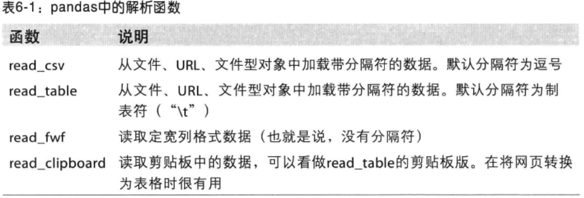
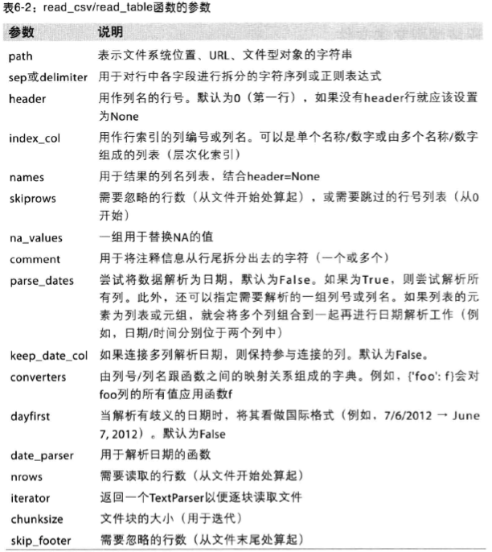
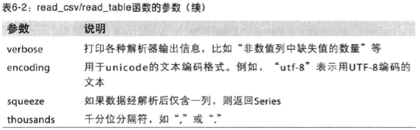
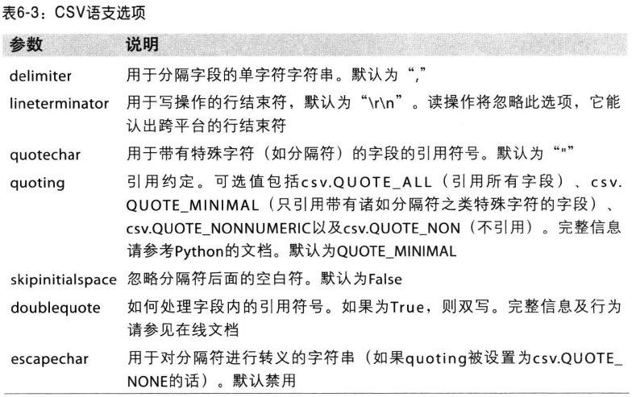

本部分为pandas的输入输出对象。

# 1 读写文本格式的数据

先上表，其中read_csv和read_table最常用。




这些函数的选项可以划分几类：
- 索引：
- 类型推断和数据转换：
- 日期解析：
- 迭代：
- 不规整数据问题：

类型推断（type inference）：不需要指定数据类型，可以自动识别。
```python
In [286]: df = pd.read_csv('../_data/source/ch06/ex1.csv')

In [287]: df
Out[287]:
   a   b   c   d message
0  1   2   3   4   hello
1  5   6   7   8   world
2  9  10  11  12     foo

In [289]: pd.read_table('../_data/source/ch06/ex1.csv',sep=',')
Out[289]:
   a   b   c   d message
0  1   2   3   4   hello
1  5   6   7   8   world
2  9  10  11  12     foo
```
```python
In [290]: cat ../_data/source/ch06/ex2.csv
1,2,3,4,hello
5,6,7,8,world
9,10,11,12,foo

In [291]: pd.read_csv('../_data/source/ch06/ex2.csv',names=['a','b','c','d','message'])
Out[291]:
   a   b   c   d message
0  1   2   3   4   hello
1  5   6   7   8   world
2  9  10  11  12     foo

In [292]: names=['a','b','c','d','message']

In [293]: pd.read_csv('../_data/source/ch06/ex2.csv',names=names, index_col='message')
Out[293]:
         a   b   c   d
message               
hello    1   2   3   4
world    5   6   7   8
foo      9  10  11  12
```

read_csv时可以使用skiprows跳过文件的某些行。

```python
In [294]: !cat ../_data/source/ch06/ex4.csv
# hey!
a,b,c,d,message
# just wanted to make things more difficult for you
# who reads CSV files with computers, anyway?
1,2,3,4,hello
5,6,7,8,world
9,10,11,12,foo
In [295]: pd.read_csv('../_data/source/ch06/ex4.csv',skiprows=[0,2,3])
Out[295]:
   a   b   c   d message
0  1   2   3   4   hello
1  5   6   7   8   world
2  9  10  11  12     foo
```

```python
In [296]: !cat ../_data/source/ch06/ex5.csv
something,a,b,c,d,message
one,1,2,3,4,NA
two,5,6,,8,world
three,9,10,11,12,foo
In [297]: pd.read_csv('../_data/source/ch06/ex5.csv')
Out[297]:
  something  a   b     c   d message
0       one  1   2   3.0   4     NaN
1       two  5   6   NaN   8   world
2     three  9  10  11.0  12     foo

In [298]: result = pd.read_csv('../_data/source/ch06/ex5.csv')

In [299]: result.isnull()
Out[299]:
  something      a      b      c      d message
0     False  False  False  False  False    True
1     False  False  False   True  False   False
2     False  False  False  False  False   False
```

read_csv/read_table选项：






## 1.1 逐块读取文本文件

当文件太大时候，我们只想读取其中一部分。
```python
In [303]: result = pd.read_csv('../_data/source/ch06/ex6.csv',nrows=5)

In [304]: result
Out[304]:
        one       two     three      four key
0  0.467976 -0.038649 -0.295344 -1.824726   L
1 -0.358893  1.404453  0.704965 -0.200638   B
2 -0.501840  0.659254 -0.421691 -0.057688   G
3  0.204886  1.074134  1.388361 -0.982404   R
4  0.354628 -0.133116  0.283763 -0.837063   Q

In [305]: chunker = pd.read_csv('../_data/source/ch06/ex6.csv',chunksize=1000)

In [306]: chunker
Out[306]: <pandas.io.parsers.TextFileReader at 0x1147e5850>

```
## 1.2 将数据写到文本格式

```python
In [323]: data = pd.read_csv('ex5.csv')

In [324]: data
Out[324]:
  something  a   b     c   d message
0       one  1   2   3.0   4     NaN
1       two  5   6   NaN   8   world
2     three  9  10  11.0  12     foo

In [325]: data.to_csv('out.csv')

In [326]: cat out.csv
,something,a,b,c,d,message
0,one,1,2,3.0,4,
1,two,5,6,,8,world
2,three,9,10,11.0,12,foo


In [327]: data.to_csv('out.csv',sep="|")

In [328]: cat out.csv
|something|a|b|c|d|message
0|one|1|2|3.0|4|
1|two|5|6||8|world
2|three|9|10|11.0|12|foo

In [329]: import sys

In [330]: data.to_csv(sys.stdout,na_rep='NULL')
,something,a,b,c,d,message
0,one,1,2,3.0,4,NULL
1,two,5,6,NULL,8,world
2,three,9,10,11.0,12,foo

In [331]: data.to_csv(sys.stdout,index=False,header=False)
one,1,2,3.0,4,
two,5,6,,8,world
three,9,10,11.0,12,foo

In [332]: data.to_csv(sys.stdout,index=False,columns=list('abc'))
a,b,c
1,2,3.0
5,6,
9,10,11.0

```
Series也有类似方法

```python
In [333]: dates = pd.date_range('2/1/2017',periods=7)

In [334]: s1 = Series(np.arange(7),index=dates)

In [335]: s1.to_csv(sys.stdout)
2017-02-01,0
2017-02-02,1
2017-02-03,2
2017-02-04,3
2017-02-05,4
2017-02-06,5
2017-02-07,6
```

## 1.3 手工处理分隔符

CSV文件的形式有很多，只需要定义csv.Dialect的一个子类接口。




# 2 二进制数据格式

# 3 使用html和web api

# 4 使用数据库
